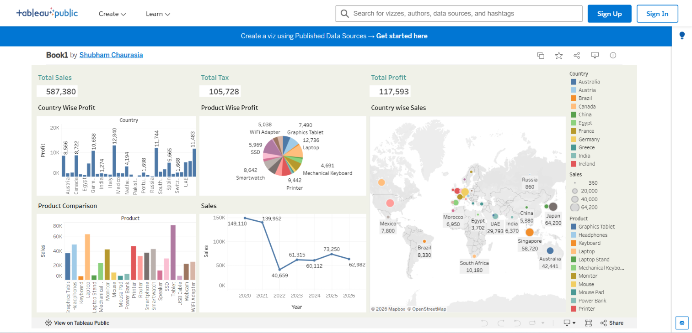

# Global Sales Analysis Dashboard

## 📊 Overview

An interactive Tableau dashboard created to analyze global sales performance, profitability, product performance, country-wise sales, and year-wise sales trends.

## 🛠️ Tools Used

- Tableau
- Data Visualization
- Data Analysis
- Dashboard Design
- KPI Analysis

## 📌 Dashboard Features

- Total Sales
- Total Tax
- Total Profit
- Country-wise Profit
- Product-wise Profit
- Country-wise Sales Map
- Product Comparison
- Year-wise Sales Trend

## 📷 Dashboard Preview

## 🔗 Live Dashboard

[View Interactive Tableau Dashboard](https://public.tableau.com/app/profile/shubham.chaurasia6296/viz/Book1_17895714977330/Dashboard1?publish=yes)
